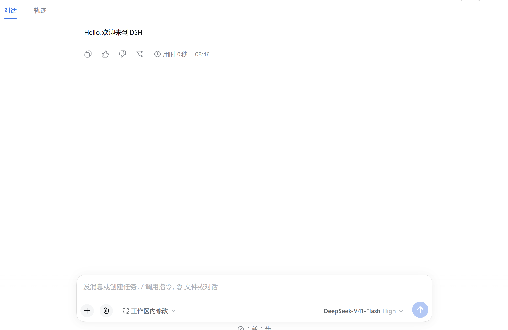

# dsh-welcome

[](https://www.npmjs.com/package/dsh-welcome)
[](./LICENSE)

DSH（DeepSeek Harness）插件：**每个新建的空会话自动发一条欢迎消息**「Hello,欢迎来到DSH」，
由助手以**正常的助手气泡**直接输出（不是带 plugin 标签的上下文注入）。

## 快速开始

> 面向使用者，三步完成。开发者请看[本地开发](#本地开发)。

### 1. 安装

```powershell
dsh plugin --profile web add dsh-welcome
# 指定版本
dsh plugin --profile web add dsh-welcome@1.0.0
# 或 npx 形式
npx @deepseek-ai/dsh plugin --profile web add dsh-welcome
```

### 2. 配置（可选）

在 `$DSH_HOME/profiles/web/cordis.patch.yml` 里可覆盖欢迎语、provider/model
（行 id 为 `welcome`）：

```yaml
- id: welcome
  config:
    greeting: 'Hello,欢迎来到DSH'
    provider: 'deepseek-official'
    model: 'deepseek-v4-flash'
```

### 3. 验证

重启 `dsh web`（web profile 的 HMR 被禁用，新装/更新的插件必须重启才生效）：

```powershell
# 停掉正在运行的 dsh web（Ctrl+C），再重新启动
dsh web
# 未全局安装 dsh 时，用 npx 形式
npx @deepseek-ai/dsh web
```

然后在 web UI 新建一个会话：

- 对话顶部出现一条**助手气泡**「Hello,欢迎来到DSH」→ 安装成功；



## 目录结构

```
dsh-welcome/
├── package.json      # dsh.bundle.patch 声明 → dsh plugin 会自动把它加入 bundles 层
├── index.js          # Cordis 插件本体（name / inject / Config / apply）
├── cordis.patch.yml  # bundle patch：把自己的 Loader 行插入配置树
├── test.mjs          # 逻辑单元测试（node test.mjs）
└── README.assets/    # README 截图等静态资源
```

## 本地开发

### 从本地源码安装

面向两种情况：

1） 开发者本地改源码调试

2） npm 版本不满足需求，从 GitHub 下载源码安装。

下载完成并解压后执行下面命令

```powershell
# 需要 pnpm 在 PATH 上（npm i -g pnpm）
dsh plugin --profile web add "file:D:\path\to\dsh-welcome"
# 未全局安装 dsh 时，用 npx 形式
npx @deepseek-ai/dsh plugin --profile web add "file:D:\path\to\dsh-welcome"
```

`dsh plugin add` 会：

1） pnpm 安装到 profile 的 node_modules；

2） 检测到包声明了 `dsh.bundle.patch`，自动把它追加到 `dsh.profile.bundles` 层列表。

### 改了源码怎么让 profile 更新

profile 用 `nodeLinker: hoisted`，`node_modules/dsh-welcome` 是安装时**复制**的
真实目录（不是软链）；而 pnpm 对 `file:` 目录依赖在 lockfile 里只记
`version: file:<路径>`，不含版本号——重跑 `add` / `install`（含 `--force`）都是
空操作（`Already up to date`）。

可靠做法是**先 `remove` 再 `add`**（`dsh plugin` 是 pnpm 的薄转发器，`remove`
会把副本、依赖声明、bundles 条目一并清掉）：

```powershell
dsh plugin --profile web remove dsh-welcome
dsh plugin --profile web add "file:D:\path\to\dsh-welcome"
# 未全局安装 dsh 时，用 npx 形式
npx @deepseek-ai/dsh plugin --profile web remove dsh-welcome
npx @deepseek-ai/dsh plugin --profile web add "file:D:\path\to\dsh-welcome"
```

- 验证是否生效：

  1、比对 `node_modules\dsh-welcome\package.json` 的 `version` 与源码。

  2、重启 `dsh web`，新建会话看是否改变修改的内容。

## License

MIT © [axingde](https://github.com/axingde) — 仓库：<https://github.com/axingde/dsh-welcome>
